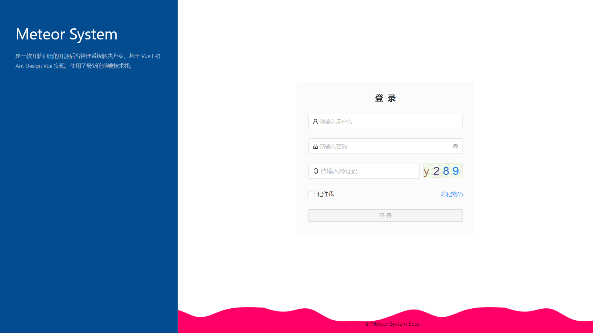
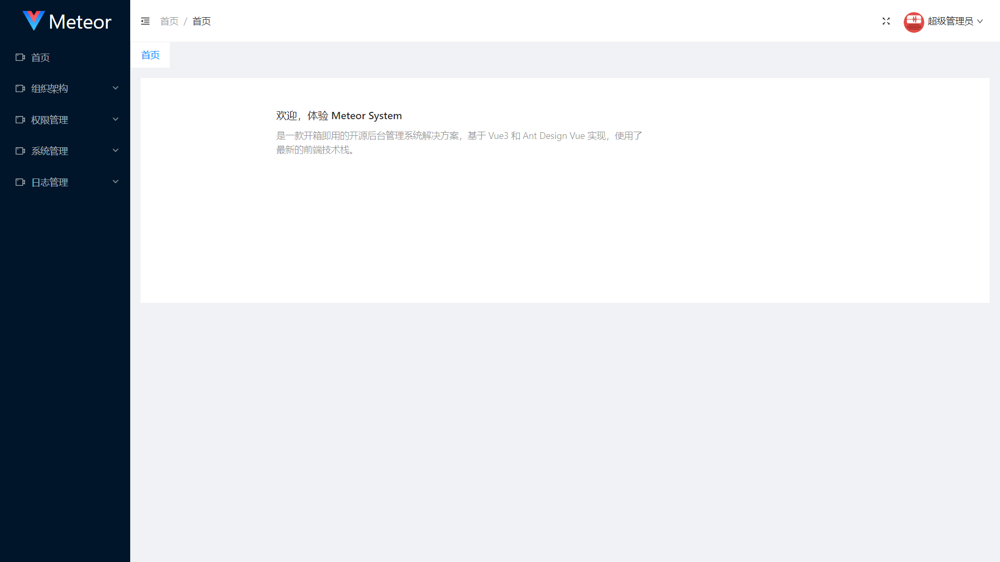
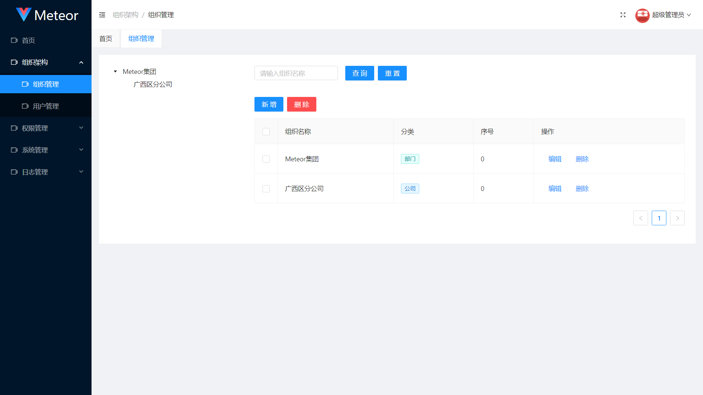
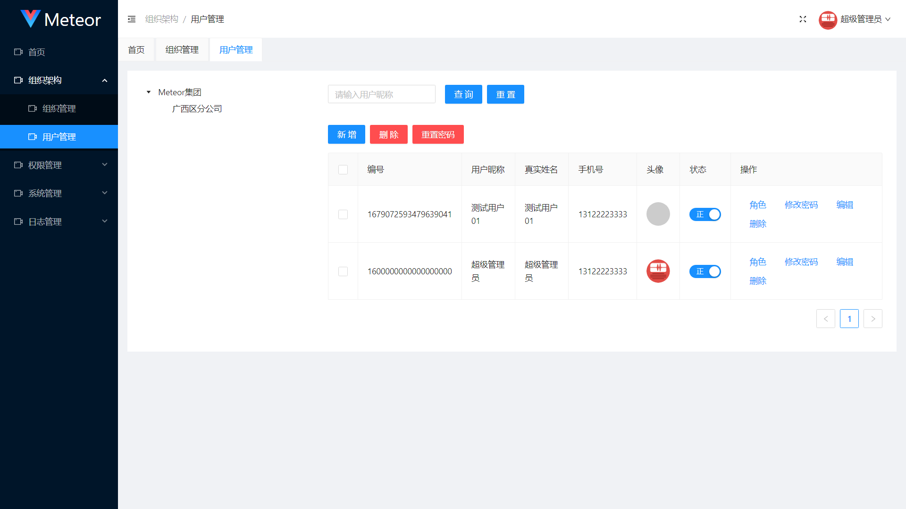
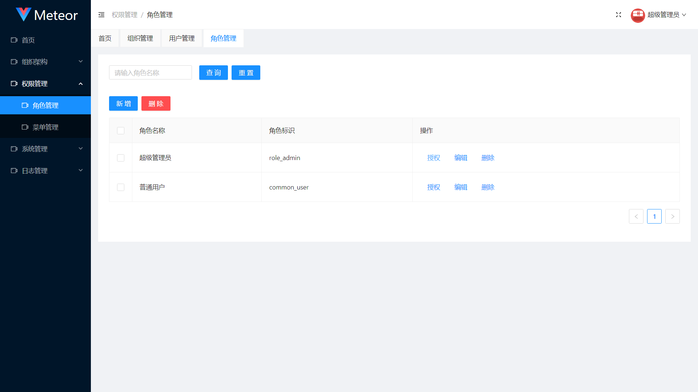
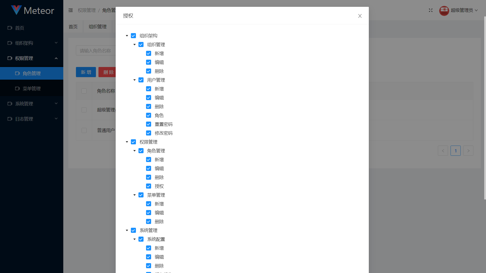
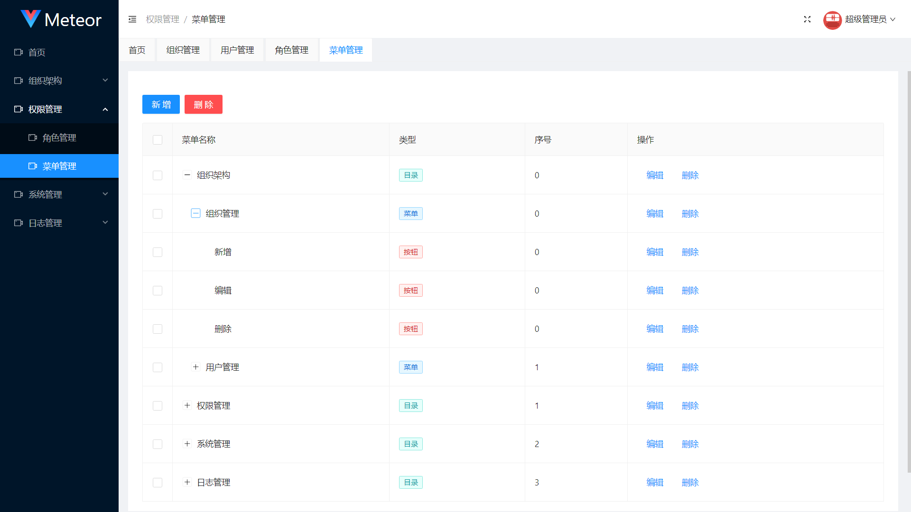
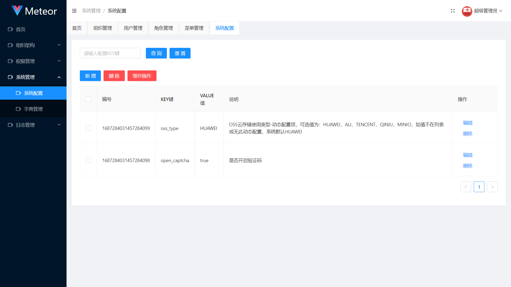
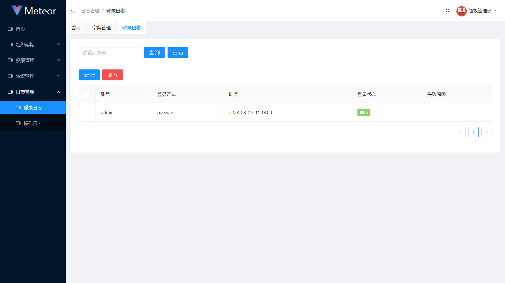

<div align="center">

<h1>Meteor</h1>
<p align="center">
    <a href="" target="_blank">
		
	</a>
	<a href="" target="_blank">
		
	</a>
	<a href="" target="_blank">
		
	</a>
	<a href="" target="_blank">
		
	</a>
	<a href="" target="_blank">
		
	</a>
</p>
</div>

## 介绍📖

Meteor 采用前后端分离的模式最新的技术架构，基于 springboot3 和 jdk17框架，可以作为后端服务的开发脚手架。代码简洁、架构清晰的敏捷开发基础模板，适合学习和直接项目中使用。

目前正在持续更新中，对于项目有不完善的地方，希望大家能多提意见。（⭐🤣）

## 快速启动📖

以下为后台启动的过程：

1. 在mysql数据库中创建meteor数据库，推荐mysql8版本。


2. 导入项目sql文件夹中对应版本的基础sql。


3. 修改`application-dev.yml`中的数据库连接配置连接到您的数据库，以及对应的`redis`信息。


4. 打开`MeteorApplication`运行main方法即可启动。


5. 前端项目启动详见：https://github.com/huangjiayao1993/Meteor-Meteor


6. 初始化账号密码：admin/12345678

## 在线预览👀

待测试环境部署，或本地部署

## 效果图👀












## 仓库地址📚

| 类型            | 说明     | 链接（欢迎Star⭐）                                      |
|---------------|--------|--------------------------------------------------|
| Meteor        | Java后台 | https://github.com/huangjiayao1993/Meteor        |
| Meteor-System | Vue前端  | https://github.com/huangjiayao1993/Meteor-Meteor |

## 技术栈

| 依赖           | 说明            | 版本      |
|--------------|---------------|---------|
| JDK          | Java基础版本      | 17      |
| Spring Boot  | 基础服务框架        | 3.1     |
| MyBatis Plus | MyBatis 增强工具包 | 3.5.3.1 |
| Hutool       | 全能型工具包        | 5.8.18  |
| Sa Token     | 轻量级权限认证框架     | 1.35    |

## 模块说明

```
doc -- 相关文档

sql -- 全量基础版本sql文件

meteor
 ├── aspect -- aop管理
 ├── config -- 系统配置管理
 ├── constants -- 全局常量
 ├── dto -- 请求模型
 ├── entity -- 数据库实体
 ├── enums -- 枚举管理
 ├── exception -- 异常管理
 ├── listener -- 监听器
 ├── mapper -- mapper
 ├── model -- 常用模型
 ├── modules -- 业务模块
 │   ├── system -- 后台管理系统模块
 │   │    ├── runner -- 后台系统业务等启动管理
 │   │    └── web -- 后台系统模块API
 │   └── website -- 官网模块
 ├── resolver -- 解析管理
 ├── service -- 业务层
 ├── utils -- 工具集
 ├── vo -- 接口返回模型
 └── web -- 权限管理等公用API
```

## 功能列表
1. 组织管理
2. 用户管理
3. 角色管理
4. 菜单管理
5. 系统配置
6. 字典管理
7. 登录日志
8. 操作日志


9. 持续更新...

## 开源协议
